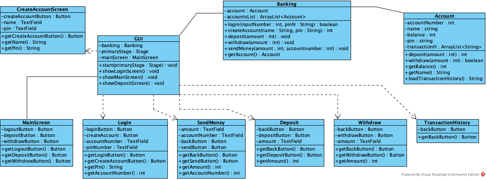

# Banking System V2
## Table of Contents
[Overview](#overview)  
[Features](#features)  
[Technology used](#technology-used)  
[Screenshots](#screenshots)  
[Project Structure](#project-structure)  
[Class Diagram](#class-diagram)
[Future Plans](#future-plans)  
[Learning Outcomes](#learning-outcomes)  
## Overview
A desktop banking application built in Java as a learning project alongside my university studies. This is the second iteration of the project, rebuilt from scratch to properly implement Object-Oriented Programming principles such as encapsulation and separation of concerns.

The application supports multiple user accounts with persistent file-based storage. It was originally developed as a CLI application and later enhanced with a JavaFX graphical interface to strengthen my understanding of desktop UI development.

This project serves as a foundation before transitioning to full-stack development using React and Spring Boot.
## Features

- User login and authentication
- Account generation with auto-generated account numbers
- Account creation
- Deposit funds
- Withdraw funds (with balance validation)
- Transfer funds between accounts
- Transaction history tracking
- Persistent data storage using text files
- Logout

## Technology used

**Language:** Java 25  
**Graphical Interface:** JavaFX 25.0.2  
**Data Storage:** File-based storage (.txt files)    
**IDE:** IntelliJ

## Screenshots
### Login Screen
  

### Main Screen
  

### Deposit Screen
  

### Withdraw Screen
  

### Send Money Screen

### Transaction History Screen
 

### Create Account Screen
  

## Project Structure
### Presentation Layer
`Gui.java` - Main application controller, manages scene switching and coordinates between UI logic and Business logic   
`Login.java` - Login Screen UI  
`CreateAccount.java` - Account creation screen UI  
`MainScreen.java` - Main dashboard displaying account information and navigation  
`Deposit.java` - Deposit transaction screen UI  
`Withdraw.java` - Withdraw transaction screen UI  
`SendMoney.java` - Money transfer screen UI  
`TransactionHistory.java` - Transaction history screen UI
### Business Logic Layer
`Banking.java` - Core banking operations (login, account management, transactions)  
### Data Model
`Accounts.java` - Account entity with balance, transactions such as deposit and withdraw, and file persistence
## Class Diagram

## Future Plans
- Rebuild as a full-stack web application with:  
- **Frontend:** React-based user-interface
- **Backend:** Spring Boot REST API
- **Database:** SQL database (replace file based storage)
- **Additional** Features: Multiple account types, interest rates, transaction categories, user roles/permissions
## Learning Outcomes
### Object Oriented Design:
- Developed understanding of separation of concern by creating dedicated classes for each feature/function and responsibility  
- Applied encapsulation principles, keeping class fields private and exposing functionality through public methods
- I recognised poor design in V1 and successfully refactored the entire project to follow OOP principles
### JavaFx and GUI Development:
- I initially struggled with JavaFx event handling specifically with buttons but gained understanding through research.
- Learned to structure GUI applications using the application class and scene management
- Practiced building reusable UI components with consistent layouts and styling
### Ongoing Challenges
- Currently working on proper error handling for user input validation (Text field parsing, empty inputs)
- Learning to balance user experience with error prevention

